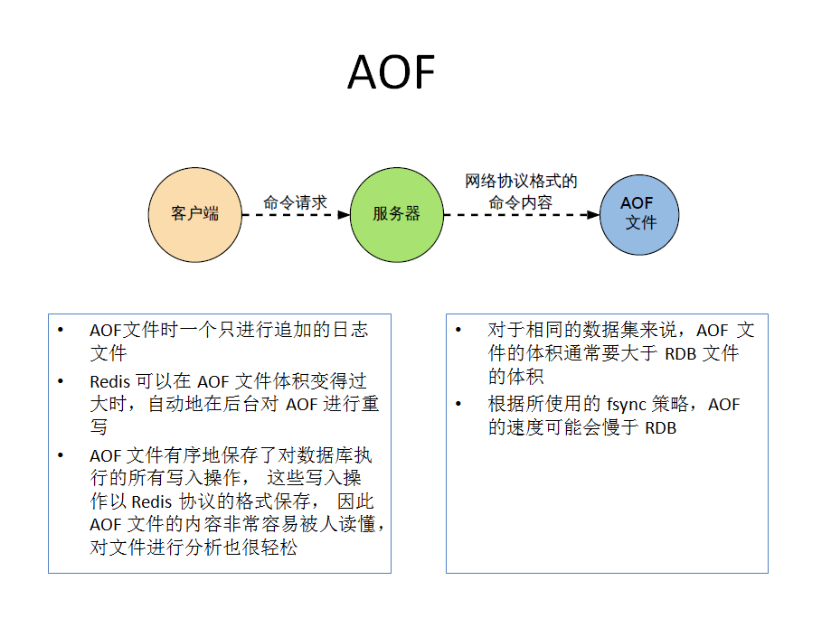

## 2016版

### _1、nosql是什么？_
    
泛指非关系型数据库，这些类型的数据存储不需要固定的模式，无需多余操作就可以横向扩展，优点易扩展，读写效率高，多样灵活的数据类型（mysql增删字段麻烦）

### _2、nosql优势？_

3V+3高：海量Volume、多样Variety、实时Velocity；高并发、高可用（横向扩展，一台机器不够再加）、高性能（单点故障，容灾备份）

IOE：IBM小型机、Oracle、EMC存储设备

### _3、数据库的ACID和CAP原理_

传统ACID：

A：Atomicity原子性
C：Consistency一致性
I：Isolation独立性
D：Durability持久性

经典CAP：

C：Consistency强一致性
A：Availability可用性（高可用）
P：Partition tolerance分区容错性（分布式容忍性）

**CAP 3进2**

CAP理论就是说在分布式存储系统中，最多只能实现上面的两点。而由于当前的网络硬件肯定会出现延迟丢包等问题，所以分区容忍性是我们必须需要实现的。所以我们只能在一致性和可用性之间进行权衡，没有NoSQL系统能同时保证这三点：C:强一致性 A：高可用性 P：分布式容忍性（CA 传统Oracle数据库、AP 大多数网站架构的选择、CP Redis、Mongodb）

### _4、Redis分布式内存数据库_

1. 是什么？

    REmote DIctionary Server（远程字典服务器），完全开源免费，C语言编写，遵守BSD协议，是一个高性能的k/v分布式内存数据库，基于内存运行，并支持持久化的nosql数据库，成为数据结构服务器，特点：
    > - 支持数据持久化，将内存中的数据保持在磁盘，重启的时候可以再次加载进行使用。
    > - 支持简单的k/v类型的数据，提供list、set、zset、hash等数据结构的存储。
    > - 支持数据的备份，即master-slave模式的数据备份

2. 能干嘛？

    > - 内存存储和持久化：redis支持异步将内存中的数据写到硬盘上，同事不影响继续服务
    > - 取最新N个数据

### _5、redis的五大数据类型_

> - String：一个key对应一个value，是二进制安全的eg.jpg图片或者序列化的对象，一个redis中字符串value最多可以是512M
> - Hash：redis hash是一个键值对集合，类似java的map<String,Object>
> - List（列表）：redis列表是简单的字符串列表，按照插入顺序排序，可添加一个元素到列表的头部（左边）或者尾部（右边），它的底层实际上是个链表
> - Set（集合）：是string类型的无序集合，通过hashtable实现
> - ZSet（sorted set：有序集合）：redis zset和set都是string类型元素的集合，且不允许重复的成员，**不同的是每个元素都会关联一个double类型的分数**，redis正式通过分数来为集合中的成员进行从小到大的排序，zset的成员是唯一的，**但分数score却可以重复**

### _6、过期时间策略_

> - Volatile-lru：最近最少使用，使用LRU算法移除key，支队设置了过期时间的键
> - Allkeys-lru：使用LRU算法移除key
> - Volatile-random：在过期集合中移除随机的key，只对设置了过期时间的键
> - Allkeys-random：移除随机的key
> - Volatile-ttl：移除哪些TTL值最小的key，即那些最近要过期的key
> - Noeviction：永不过期，针对写操作，只是返回错误信息

### _7、redis持久化_

> - **RDB(Redis DataBase)**：在指定的时间间隔内将内存中的数据集快照写入磁盘，也就是行话将的snapshot快照，它恢复时会将快照文件又直接读入内存中。redis会单独创建（fork）一个子进程来进行持久化，会将数据写入到整个过程中，主进程是不进行任何IO操作的，这就确保了极高的性能，如果需要进行大规模数据的恢复，且对于数据恢复的完整性不是非常敏感，那么RDB方式要比AOF方式更加的高效，RDB的缺点是最后一次持久化后的数据可能丢失。save命令立刻备份
> - **AOF(Append Only File)**：备份时间间隔为1秒，以日志的形式来记录每个写操作，将redis执行过的所有写指令记录下来，不记录读操作，只许追加文件但不可以改写文件，redis启动之初会读取该文件重新构建数据，换言之，redis重启的话就根据日志文件的内容将写指令从前到后执行一次以完成数据的恢复工作，**Rewrite**：aof文件越写越大，新增重写机制，当aof文件的大小超过所设定的阈值时，redis就会启动aof文件的内容压缩，只保留可以恢复数据的最小指令集，可以使用命令bgrewriteaof；**重写原理**：AOF文件持续增长而过大时，会fork出一条新进程将文件重写(也是先写临时文件最后再rename)，遍历新进程的内存中数据，每条记录有一条的Set语句。重写aof文件的操作，并没有读取旧的aof文件，而是将整个内存中的数据库内容用命令的方式重写了一个新的aof文件，类似快照。**触发机制：redis会记录上次重写时的AOF大小，默认配置是当AOF文件大小是上次rewrite后大小的一倍且文件大于64M时触发**

**redis启动先加载aof文件，恢复aof文件：redis-check-aof --fix appendonly.aof**

### _8、AOF和RDB的区别、策略_

参考7，AOF和RDB可共存，redis优先加载AOF文件。

AOF优势：
> - 每修改同步：appendfsync always   同步持久化 每次发生数据变更会被立即记录到磁盘  性能较差但数据完整性比较好
> - 每秒同步：appendfsync everysec    异步操作，每秒记录   如果一秒内宕机，有数据丢失
> - 不同步：appendfsync no   从不同步

AOF劣势：
> - 相同数据集的数据而言aof文件要远大于rdb文件，恢复速度慢于rdb
> - Aof运行效率要慢于rdb,每秒同步策略效率较好，不同步效率和rdb相同

### _9、redis的事务_

是什么：可以一次执行多个命令，本质时一组命令的集合，一个事务中所有命令都会序列化，**按顺序地串行化执行而不会被其他命令插入，不许加塞**。

能干嘛：一个队列中，一次性，顺序性，排他性的执行一系列命令。

怎么玩：MULTI开启,不一定开启成功;EXEC执行，DISCARD丢弃事务;WATCH监控一个或多个key，如果在事务执行之前这些key被其他命令所开动给，那么事务将被打断

**redis对事务的支持是部分支持**，在执行事务的过程就报错会牵连所有操作，但在执行事务时才报错则不会影响其他的操作

表锁、行锁，列锁，间隙锁

### _10、redis的发布订阅（了解）_

1. 概念：进程间的一种消息通信模式，发送者（pub）发送消息，订阅者（sub）接收消息

### _11、redis的主从复制_

1. 概念：主机数据更新后根据配置和策略，自动同步到备机的master/slave机制，master以写为主，slave以读为主

2. 如何使用？

> - 配从（库）不配主（库）
> - 从库配置：slaveof 主库ip 主库端口（每次与master断开之后，都需要重新连接，除非你配置进redis.conf文件）
> - 修改配置文件细节操作：拷贝多个(3个)redis.conf文件、开启daemonize yes、修改pid文件、log文件名字修改（logfile "6379"）、dump.rdb文件
> - 常用3招：

    一主二仆：从机读，主机写，如果从机写入和主机一样的会报错，实现读写分离，如果主机挂了，其他两台从机依旧是从机的身份，默认配置，主机重启依旧是主机，从机原地待命，但是如果从机挂掉之后，再重启，该从机会恢复成原来默认的master，需重新设置为master的从机才行

    薪火相传：上一个slave可以是下一个slave的master，slave同样可以接收其他slaves的连接和同步请求，那么该slave作为了链条中下一个的master，可以有效减轻master的写压力，中途变更转向：会清除之前的数据，重新简历拷贝最新的，SLAVEOF 新机ip:新机端口

    反客为主：SLAVEOF no one（将当前从机设置成为master）

info replication：查看是否为master || slaver的信息

SLAVEOF 127.0.0.1:6379：做6379的slave，作为备份

3. 复制原理：slave启动成功连接到master后会发送一个sync命令，

4. 哨兵模式：
> - 概念：反客为主的自动版，能够后台监控主机是否故障，如果故障了根据投票数自动将从库转换为主库
> - 自定义sentinel.conf文件，vi此文件：sentinel monitor host6379 127.0.0.1 6379 1， 1表示主机挂掉后slave投票看谁成为新的主机，得票数多成为新主机，启动哨兵：Redis-sentinel /myredis/sentinel.conf

复制延时：由于所有的写操作都是先在Master上操作，然后同步更新到Slave上，所以从Master同步到Slave机器有一定的延迟，当系统很繁忙的时候，延迟问题会更加严重，Slave机器数量的增加也会使这个问题更加严重。

5. 主从复制，目的
> - 读写分离
> - 容灾备份

### _命令_

1. redis默认安装16个库,redis索引从0开始，选择库：select 0
2. 查看key的数量大小：DBSIZE
3. 罗列所有key：keys *（不推荐用*号，最好用具体的key值，或者keys k?会查看k开头的key）
4. 清除当前一个库的所有key：FLUSHDB
5. 清除所有库的所有key：FLUSHALL（不推荐，有风险）
6. 剪切（将k3这个key移动到2号库中）：move k3 2
7. 给key设置过期时间：EXPIRE key 秒钟
8. 查看还有多少秒过期，-1表示永不过期，-2表示已过期，过期会移除：ttl key
9. 查看key的类型：type key
10. 删除key：DEL key
11. INCR/decr/incrby/decrby：针对数字进行加减，一定要是数字(原子性操作)
12. getrange/setrange（eg.GETRANGE k1 0 -1)：截取字符串
13. setex（set with expire） 键秒值/setnx（set if no exist）键不存在才会设置：设置过期时间
14. 合并设置值：mset k1 v1 k2 v2 k3 v3(当且仅当所有key不存在时，设置才生效)
15. 先get再set，以新换旧，设置了新值同时获得旧值：getset
16. lpush/rpush/lrange：新增值，左边先进/新增值，右边先进/获取某个范围中的值，做右边出来（lrange k1 0 -1）
17. lpop/rpop（lpop list01）：每次出一个值，先出栈顶
18. lindex，按照索引下标获得元素（从上到下）：lindex list01 2
19. llen：获取列表长度
20. lrem key：删除n个value，lrem list01 2 3（删除2个3）
21. ltrim key：开始index，结束index，截取指定范围的值后再赋值给key，eg ltrim list1 3 5
22. rpoplpush：rpoplpush list01 list02 
23. lset key index value
24. linsert key before/after 值1 值2：把某个值插入某个key中

25. sadd/smembers/sismember：新增值/查看值/
26. scard：获取集合里面的元素个数
27. srem key value：删除集合中元素 srem set01 3 删除3
28. srandmember key：某个整数（随机出几个数）
29. spop key：随机出栈
30. smove key1 key2 在key1里某个值：作用是将key1里的某个值赋给key2
31. 数学集合类：

    差集：sdiff（sdiff set01 set02）：在第一个集合里面并且不在第二个集合里

    交集：sinter

    并集：sunion

32. hset/hget/hmset/hmget/hgetall/hdel：eg hset user name z3(user为key，name和z3为value，并且是一个键值对)

## 2019版

### _1、NoSQL(not only sql)_

不依赖业务逻辑方式存储，而以简单的k/v形式存储，因此大大的增加了数据库的扩展能力，不遵循sql标准，不支持ACID，远超于sql的性能。

适用场景：对数据高并发的读写、海量数据的读写、对数据可扩展性的

不适用场景：需要事务支持（和ACID无关）、基于sql的结构化查询存储，处理复杂的关系，需要即席查询（条件查询）

### _2、redis单线程+多路IO复用技术_

多路复用是指适用一个线程检查多个文件描述符（socket）的就绪状态，比如调用select和poll函数，传入多个文件描述符，如果有一个文件描述符就绪，则返回，否则阻塞直到超时，得到就绪状态后进行真正的操作可以在同一个线程里执行，也可以启动线程执行（比如适用线程池）

串行 vs 多线程+锁（memcached）
单线程+多路IO复用（redis）

### _3、tcp-backlog_

理解时一个请求到达后至到接收进程处理前的队列

backlog队列综合=未完成三次握手队列 + 已完成三次握手队列

高并发环境tcp-backlog设置值跟超时时限内的redis吞吐量决定

吞吐：redis处理请求的的速度

处理请求的速度快，此值可设置大一些，反之不可

### _4、设置密码_

config set requirepass "123456"

登录：auth "123456"

maxmemory-samples：设置样本数量，lru算法和最小ttl算法都并非时精确的算法，二十估算值，所以可以设置样本的大小，一般设置3-7的数字，数值越小样本越不精确，但是性能消耗也越小

### _6、redis事务_

redis事务是一个单独的隔离操作，事务中的所有命令都会序列化，按顺序地执行，事务在执行的过程中，不会被其他客户端发送来的命令请求所打断

redis事务的主要作用就是串联多个命令防止别的命令插队

redis 乐观锁，cas check and set，加一个版本号用于比较，只要数据发生变化就会修改版本号，只要发现版本号不一致就不会继续往下执行

关系型数据库一般为悲观锁，分为行锁、表锁等

watch监视某个key，在key监视过程中，某个key的值发生改变，与监视时的值不同，那么该key对应的事务将会失败

特性：
> - 单独的隔离操作：事务中的所有命令都会序列化，按顺序地执行，事务在执行的过程中，不会被其他客户端发送来的命令请求所打断
> - 没有隔离级别的概念：队列中的命令没有提交之前都不会实际的被执行，因为事务提交前任何指令都不会被实际执行，也就不存在“事务内的查询要看到事务里的更新，在事务外查询不能看到”这个让人万分头痛的问题
> - 不保证原子性：redis同一个事务中如果有一条命令执行失败，其后的命令仍然会被执行，没有回滚

### _7、redis持久化_

rdb：
> - stop-writes-on-bgsave-error yes：当redis无法写入磁盘的话，直接关掉redis的写操作
> - rdbcompression yes：进行rdb保存时，将文件压缩
> - rdbchecksum yes：在存储快照后，还可以让redis使用crc64算法来进行数据校验，但是这样做会增加大约10%的性能消耗，如果希望获取到最大的性能提升，可以关闭此功能

rdb优点：
> - 节省磁盘空间（仅对比aof来说）
> - 恢复速度快

rdb缺点:
> - 虽然redis在fork时使用了写时拷贝技术，但是如果数据庞大时还是比较消耗性能
> - 在备份周期在一定间隔时间做一次备份，所以如果redis意外down掉的话，就会丢失最后一次快照后的又有修改

aof同步频率设置

rewrite：当aopf文件的大小超过所设定的阈值时，redis就会启动aof文件的内容压缩，只保留可以恢复数据的最小指令集，bgrewrite指令实现

redis如何实现重写？

aof文件持续增长而过大时，会fork出一条新进程来将文件重写（也是先写临时文件最后再rename，遍历新进程的内存数据，每条记录有一条的set语句，重写aof文件的操作，并没有读取旧的aof文件，二十将整个内存中的数据库内容用命令的方式重写了一个新的aof文件，类似快照

### _8、配从不配主_

拷贝多个redis.conf文件include
开启daemonize yes
pid文件名字pidfile
指定端口port
log文件名字修改
dump.rdb名字dbfilename
appendonly关掉或者换名字

1. 容量不够，redis如何进行扩容

2. 并发写操作，redis如何分摊

redis集群实现了redis的水平扩容，即启动N个redis节点，将整个数据库分布存储在这N个节点中，每个节点存储总数居的1/N

redis集群通过哦分区partition来提供一定程度的可用性，即使集群中有一部分节点失效或者无法进行通讯，集群也可以继续处理命令请求

### _9、redis cluster_

一个集群至少要有三个主节点
选项 --replicas 1 表示我们希望为集群中的每个主节点创建一个从节点
分配原则尽量保证每个主数据库运行在不同的ip地址，每个从库和主库不再一个ip地址上

### _9、slot_

一个redis集群包含16384个插槽（slot）

redis-cli -c：会实现自动重定向，不是一个slot下的键值，是不能使用mget、mset等多键操作

可以通过{}来定义组的概念，从而使key中{}内相同内容的键值对放到同一个slot中去，eg.set a{user} 1 or set a{user} 2 都会将值设置在同一个slot
