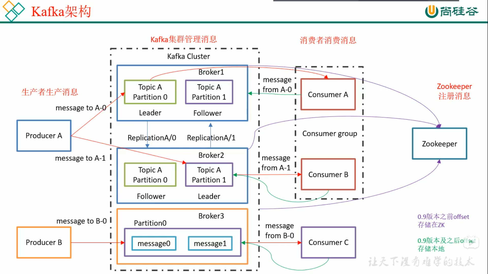
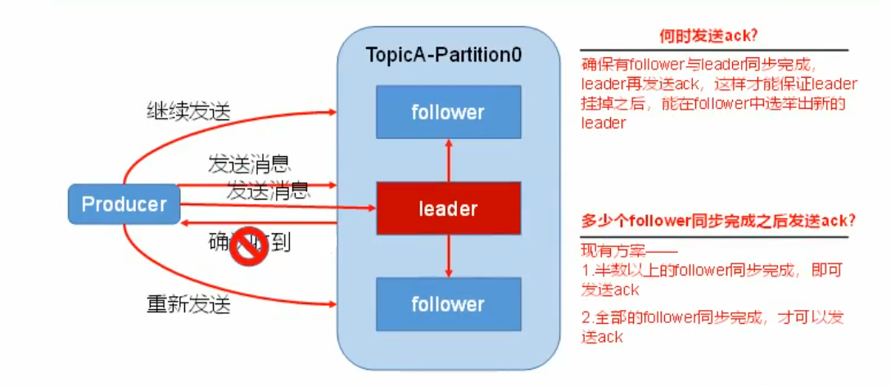
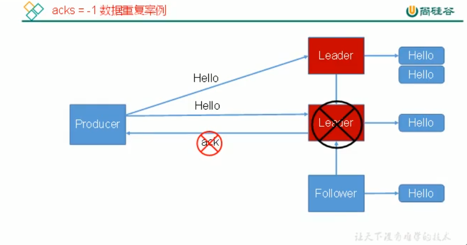
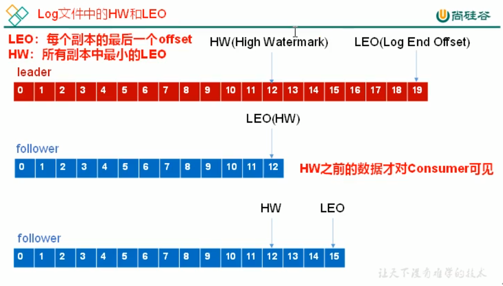
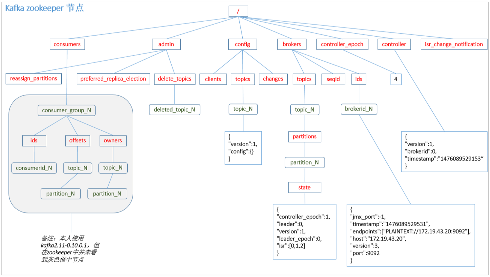
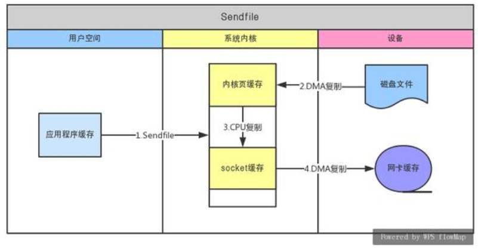
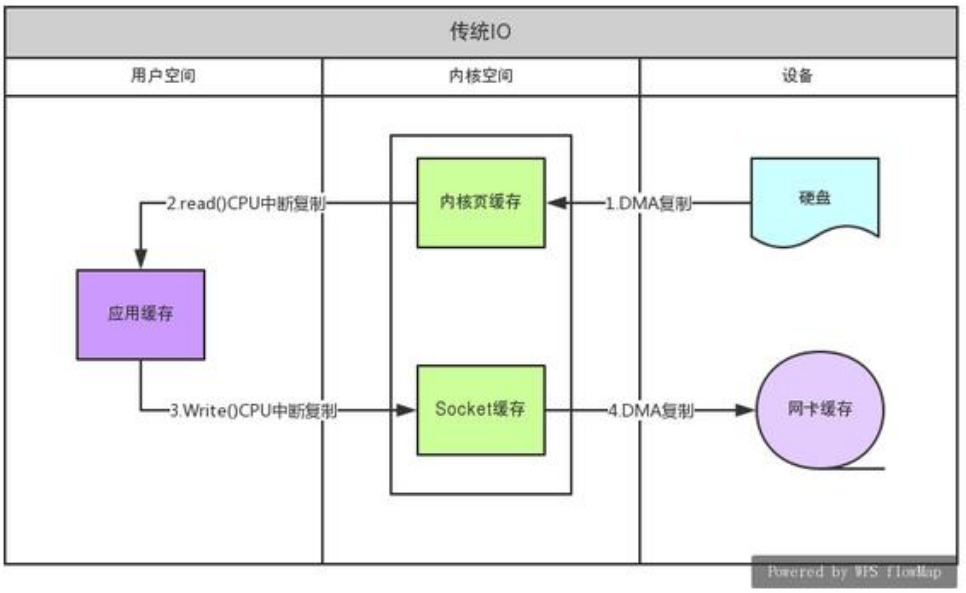
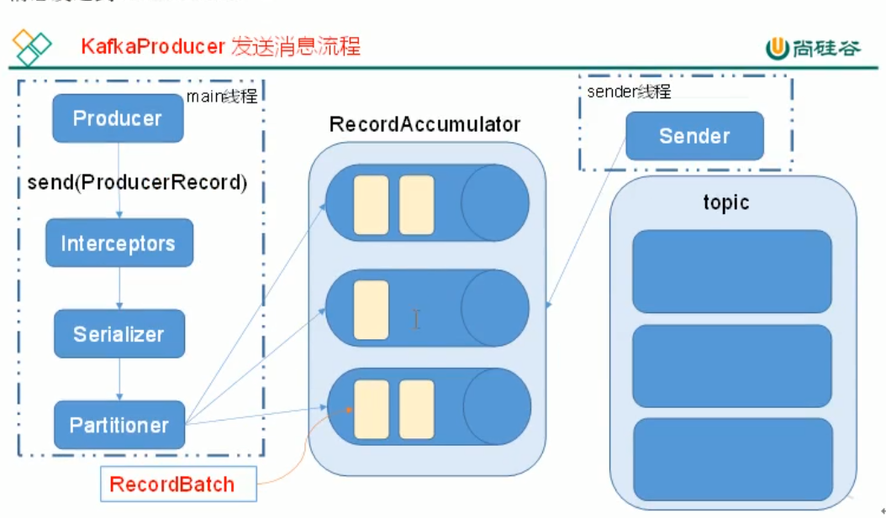

# Kafka
整体架构  

## ACK

为保证Producer发送的数据，能可靠的发送到指定的topic，topic的每个partition收到Producer发送的数据后，都需要向Producer发送ACK(acknowledgement)，如果Producer收到ACK，就会进行下一轮的发送，否则重新发送数据。  

### ack应答机制
对于某些不太重要的数据，对数据的可靠性要求不是很高，能够容忍数据的少量丢失。所以没必要等ISR中所有的follower全部接收成功。

所以Kafka为用户提供了三种可靠性级别，用户可以根据对可靠性和延迟的要求进行权衡，有以下配置：  
**0**: 生产者不等待broker的ack，这一操作提供了一个最低的延迟，broker一接收到还没有写入磁盘就已经返回，当broker故障时有可能丢失数据；
**1**: 生产者等待broker的ack，partition的leader落盘成功后返回ack，如果在follower同步成功之间leader故障，那么将会丢失数据;  
**-1**(all): 生产者等到broker的ack，partition的leader和follower全部落盘成功后才返回ack。但是如果在follower同步完成后，broker发送ack之前，leader发生故障，那么会造成数据重复  

> -1也有可能会丢数据，当ISR集合里面没有follower的时候，相当于可靠性级别退化成了1的情形，所以也存在可能丢数据的情况

## 副本同步策略  

| 方案                        | 优点                                               | 缺点                                                |
| --------------------------- | -------------------------------------------------- | --------------------------------------------------- |
| 半数以上完成同步，就发送ACK | 延迟低                                             | 选举新的leader时，容忍n台节点的故障，需要2n+1个副本 |
| 全部完成同步，才发送ACK     | 选举新的leader时，容忍n台节点的故障，需要n+1个副本 | 延迟高                                              |

Kafka选择了第二种方案，原因是：  
同样为了容忍n台节点的故障，第一种方案需要2n+1个副本，而第二种方案只需要n+1个副本，而Kafka的每个分区都有大量的数据，第一种方案会造成大量的数据冗余。  
虽然第二种方案的网络延迟会比较高，但网络延迟对Kafka的影响比较小。  
### HW(High Watermark) 与 LEO(Log End Offset)

  
**LEO**: 指的是每个副本最大的Offset；  
**HW**: 指的是消费者能见到的最大的Offset，ISR队列中的最小LEO  
由此可知，**HW保证的是集群消费数据的一致性**  

**follower故障**：  
follower发生故障后会被临时踢出ISR，待该follower恢复后，follower会读取本地磁盘记录的上次的HW，并将log文件高于HW的部分截取掉，从HW开始向leader进行同步。等该**follower的LEO大于等于该partition的HW**，即follower追上leader之后，就可以重新加入ISR了。  

**leader故障**:  
leader发生故障后，会从ISR中选出一个新的leader，之后为保证多个副本之间的数据一致性，其余的follower会先将各自的log文件**高于HW的部分截掉**，然后从新的leader同步数据。

> 这只能保证副本之间的数据一致性 ，并不能保证数据不丢失或者不重复 

## ISR(In-Sync Replica set)
在第二种方案之后，如果有一个follower迟迟未与leader进行同步，会导致leader一直等待下去，直到所有的follower完成同步才能发送ack。  

Kafka对此有着相应的解决办法，提出了ISR的办法。Leader维护了一个动态的ISR，意为何leader保持同步的follower集合，当ISR中的follower完成数据的同步之后，leader就会给follower发送ack。如果follower长时间未向leader同步数据，则该follower将会被踢出ISR，改时间阈值由`replica.lag.time.max.ms`参数设定。leader发生故障之后，就会从ISR中选举新的leader。
>replica.lag.time.max.messages 在0.9及 以后版本被移除，0.9版本之前，follower被选入ISR由两个参数控制，`replica.lag.time.max.messages`(与leader相差的最大消息条数),`replica.lag.time.max.ms`(与leader同步数据的最大延迟时间)。
>在replica.lag.time.max.messages在当消费者发送的batch超过了这个参数的时候，每当batch写入leader，那么所有的follower与leader相差的消息条数都将超过`replica.lag.time.max.messages`的限制，导致所有follower被踢出ISR当中，从而出现follower频繁的移除与加入ISR，并且ISR除了存在内存中，也还存在ZK当中，ISR频繁的变动也会导致需要频繁的操作ZK，所以之后，该参数被移除，只由`replica.lag.time.max.ms`来判断follower是否应该加入ISR

## Exactly-Once语义

将服务器的ACK级别设置为-1，可以保证生产者到服务器之间不会丢失数据，即At-Least-Once语义。相对的，将服务器ACK级别设置为0，可以保证生产者每条消息只会被发送一次，即At-Most-Once语义。  

At Least Once可以保证数据不丢失，但是不能保证数据不重复；相对的，At Least Once可以保证数据不重复，但是不能保证数据不丢失。但是对于一些非常重要的信息，比如说交易数据，下游的消费者要求数据既不能重复也不能丢失，即Exactly-Once语义。在0.11版本以前的Kafka，对此是无能为力的，只能保证数据不丢失。**0.11版本**的Kafka引入了一项重大特性：幂等性。所谓幂等性就是指生产者不论向Server发送多少次重复数据，Server都只会持久化一条。幂等性结合At Least Once语义。就构成了Kafka的Exactly-Once语义

要启用幂等性，只需要将生产者的参数中`enable.idompotence`设置为true即可。Kafka的幂等性实现其实就是将原来下游需要做的去重放在了数据上游。开启幂等性的 Producer 在初始化的时候会被分配一个 **PID**，发往同一 Partition 的消息会附带 **Sequence Number**。而Broker 端会对**<PID, Partition, SeqNumber>**做缓存，当具有相同主键的消息提交时，Broker 只会持久化一条。  

 但是 PID 重启就会变化，所以只能保证单次单会话的Exactly Once语义，同时不同的 Partition 也具有不同主键，所以幂等性**无法保证跨分区跨会话的 Exactly Once**。 

## 消费者

### 消费方式

消费者采用pull(拉取)的方式从broker中读取数据。  

推送模式很难适应消费速率不同的消费者，因为消息发送速率是由broker决定的。它的目标是尽可能 的以最快的速度传递消息，但是这样很容易造成消费者来不及处理消息，典型的表现就是拒绝服务以及网络拥塞。而pull模式则可以根据消费者的消费能力以适当的速率消费消息。  

pull模式的不足之处是，如果kafka没有数据，消费者可能会陷入循环当中，一直返回空数据。针对这一点，Kafka的消费者在消费数据的时候会传入一个 时长参数timeout，如果当前没有数可供消费，消费者会等待一段时间之后再返回，这段时长即为timeout。

### 分区分配策略

一个CG(Consumer Group)中有多个consumer，一个topic也有多个partition，所以必然会涉及到partition的分配问题，即确定哪个partition由哪个消费者来消费。有**两种**分配策略，一种是RoundRobin，一种是Range(默认)   

Round是以topic内partition进行均分(面向topic)，而RoundRobin则是将消费者组中要消费的topic都集中在一起排个序(根据TopicAndPartition类)，再进行均分(面向消费者组)

使用RoundRobin的前提是，你的消费者组内的消费者订阅的都是同一个topic

当消费者组内都订阅了同样的topic的时候，推荐使用roundRobin方式，这样可以避免消费者分到的partition不均匀的情况

当消费者组中的消费者个数发生变化的时候，会触发消费partition的重分配

### offset的维护

Kafka在0.9版本之前，consumer默认将offset保存在Zookeeper中，从0.9版本开始consumer默认将offset保存在kafka一个内置的topic中，该topic为__consumer_offsets.

如果要消费系统的topic，需要将消费者的配置文件(consumer.properties)中的`exclude.internal.topics`改成false，并且，需要使用特定的格式解析`0.11.0.0版本之前(--formatter "kafka.coordinator.GroupMetadataManager\$OffsetMessageFormatter")`，`0.11.0.0版本以及之后(--formatter "kafka.coordinator.group.GroupMetadataManager\$OffsetMessageFormatter")`

__consumer_offsets中的内容：  

  

[**消费者组**,topic,partition编号] :: [OffsetMetadata[消费的offset,NO_METADATA],CommitTime 时间戳, ExpirationTime 时间戳]

## Kafka的高效读写

### 顺序写

生产者发送到服务端的数据是追加写入到log文件当中的，为顺序写，有数据表名，同样的磁盘，顺序写能到600M/s，而随机写只有100K/s。这与磁盘的机械结构有关，顺序写之所以快，是因为其省去了大量磁头寻址的时间

### Zero-Copy(零拷贝技术)

**预备知识**   

关于I/O内存映射。   

设备通过控制总线，数据总线，状态总线与CPU相连。控制总数传送控制信号。在传统的操 作中，都是通过读写设备寄存器的值来实现。但是这样耗费了CPU时钟。而且每取一次值都 要读取设备寄存器，造成了效率的低下。在现代操作系统中。引用了I/O内存映射。即把寄存 器的值映身到主存。对设备寄存器的操作，转换为对主存的操作，这样极大的提高了效率。  

**关于DMA**  

传统的处理方法为：当设备接收到数据，向CPU报告中断。CPU处理中断，CPU把数据从设 备的寄存器数据读到内存。  

在现代操作系统中引入的DMA设备，设备接收到数据时，把数据放至DMA内存，再向CPU产 生中断。这样节省了大量的CPU时间  

**什么是零拷贝？**  

零拷贝描述的是CPU不执行拷贝数据从一个存储区域到另一个存储区域的任务，这通常用于 通过网络传输一个文件时以减少CPU周期和内存带宽。  

**避免数据拷贝**  

避免操作系统内核缓冲区之间进行数据拷贝操作。 避免操作系统内核和用户应用程序地址空间这两者之间进行数据拷贝操作。 用户应用程序可以避开操作系统直接访问硬件存储。  

**零拷贝给我们带来的好处**  

减少甚至完全避免不必要的CPU拷贝，从而让CPU解脱出来去执行其他的任务 减少内存带宽的占用  

通常零拷贝技术还能够减少用户空间和操作系统内核空间之间的上下文切换 零拷贝完全依赖于操作系统。  

**通过sendfile实现的零拷贝I/O**  

  

sendfile(socket, file, len);//file可以是文件句柄，也可以是socket句柄  

把文件数据通过网络发送出去，减少了上下文的切换,内核的缓存数据到直接网卡数据也不用 CPU去复制，由DMA完成  

第1步发出sendfile系统调用，导致用户空间到内核空间的上下文切换(第一次上下文切换)。  

第2步通过DMA将磁盘文件中的内容拷贝到内核空间缓冲区中(第一次拷贝: hard driver —— > kernel buffer)。  

第3步数DMA发出中断，CPU处理中断，将数据从内核空间缓冲区拷贝到内核中与socket相 关的缓冲区(第二次拷贝: kernel buffer ——> socket buffer)。  

sendfile系统调用返回，导致内核空间到用户空间的上下文切换(第二次上下文切换)。  

第4步通过DMA引擎将内核空间socket缓冲区中的数据传递到网卡(第三次拷贝: socket buffer ——> 网卡)。  

通过sendfile实现的零拷贝I/O只使用了2次用户空间与内核空间的上下文切换，以及3次数据 的拷贝。实现了把数据从文件发送到网卡。  

**传统的IO流程实现文件数据发送**  

read(file, tmp_buf, len);write(socket, tmp_buf, len);  

第1步调用read(),上下文切换到内核，DMA把磁盘数据复制到内核的缓存空间  

第2步read()返回，上下文切换到用户进程，CPU把数据复制到用户的缓存空间  

第3步write() 上下文切换到内核，CPU把数据复制到内核socket缓存,write返回，上下文切换 的进程  

**第4步DMP把socket缓存数据复制到网卡缓存上**  

**经过4次上下文切换，4次数据拷贝，在数据量比较大时，性能比sendfile方式低下**

**通过mmap实现的零拷贝I/O**  

mmap(内存映射)是一个比sendfile昂贵但优于传统I/O的方法。  

**MappedByteBuffer**  

在调用FileChannel.map()时使用。 与DirectByteBuffer类似，这也是JVM堆外部的情况。 它基本上作为OS mmap()系统调用的包装函数，以便代码直接操作映射的物理内存数据。  

**HeapByteBuffer**  

在调用ByteBuffer.allocate()时使用。 它被称为堆，因为它保存在JVM的堆空间中，因此你可以获得所有优势，如GC支持和缓存优化。 但是，它不是页面对齐的，这意味着如果你需要通 过JNI与本地代码交互时，比如写入网卡，写入磁盘，JVM将不得不复制到系统的页缓冲区空间。  

**DirectByteBuffer**  

在调用ByteBuffer.allocateDirect()时使用。 JVM在堆空间之外分配内存空间。 因为它不是由JVM管理的，所以你的内存空间是页面对齐的，不受GC影响，这使得它成为处理本地代码的完美选择。 然而，你要C程序员一样，自己管理这个内存，必须自己分配和释放内存来防止内存泄漏。  

**splice**

在两个文件描述符之间传输数据，不用拷贝。但输入和输出文件描述符必须有一个是pipe。 也就是说如果你需要从一个socket 传输数据到另外一个socket，是需要使用 pipe来做为中介 的 splice (socket1_fd， pipe_fd)  

splice(pipl_fd, socket2_fd）

## Zookeeper在kafka中的作用

Kafka集群中有一个broker会被选举为Controller，负责**管理集群broker的上下线**，所有topic的**分区副本分配**和**leader选举**等工作。  

> Controller的选举是抢占式的，谁最先加入集群，谁就是Controller

Controller的管理工作都是依赖于zookeeper的。

## 事务(0.11版本以及之后可以用)

事务可以保证kafka在Exactly Once语义的基础上，生产和消费可以跨分区和会话，要么全部成功，要么全部失败。  

### 生产者事务

为了实现跨分区跨会话的事务，需要引入一个全局唯一的TransactionID,并将生产者获得的PID和TransactionID绑定，这样当生产者重启后就可以通过正在进行的TransactionID获得原来的PID。  

为了管理Transaction，Kafka引入了一个新的组件，Transaction Coordinator,生产者就是通过和Transaction Coordinator交互获得TransactionID对应的任务状态。Transaction Coordinator 还负责将事务所有写入Kafka的一个内部Topic，这样即使整个服务重启，由于事务状态得到保存，进行中的事务状态可以得到恢复，从而继续进行。  

### 消费者事务

上述的事务机制主要是从生产者的方面考虑，对于消费者而言，事务的保证就会相对较弱，尤其是无法保证Commit的信息被精确消费，这是由于消费者可以通过offset访问任意信息，而不同的Segment File生命周期不同，同一事务的消息可能会出现重启后被删除的情况。

## 生产者消息发送流程

Kafka的Producer发送消息采用的是异步发送的方式。在消息发送的过程中，涉及到了**两个线程----main线程和Sender线程**，以及一个**线程共享变量----RecordAccumulator**。  

main线程将消息发送给RecordAccumulatorm，Sender线程不断从RecordAccumulator中拉取纤细发送到broker  

